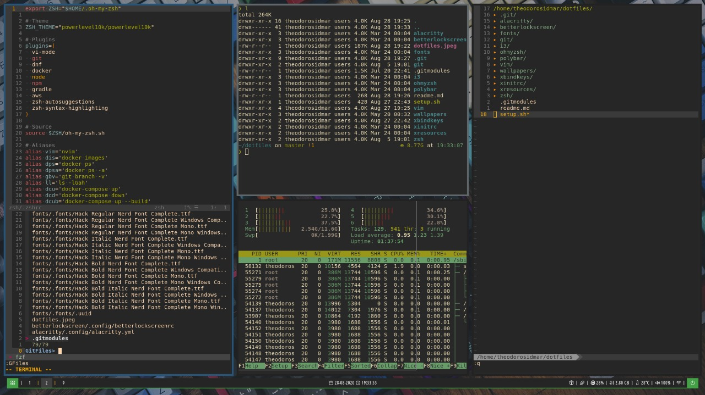

# dotfiles
So, I love organizing my stuffs on my way. Here I try to demonstrate it a little bit 🤓
<h1 align="center">
  
</h1>

## Setup
1. [Arch Linux](https://www.archlinux.org/) as operating system BTW
2. [i3wm](https://i3wm.org/) as window manager
3. [Neovim](https://neovim.io/) as the ***only*** editor
4. [Polybar](https://github.com/polybar/polybar) inspired by [Aditya Shakya](https://github.com/adi1090x/polybar-themes#-polybar-4)
5. [ohmyzsh](https://ohmyz.sh/) as shell
6. [ohmyposh](https://ohmyposh.dev/) as prompt
7. [stow](https://www.gnu.org/software/stow/) for dotfiles symlinks
8. [rofi](https://github.com/davatorium/rofi) & [dmenu](https://wiki.archlinux.org/index.php/Dmenu) as window switchers & runners
9. [Alacritty](https://github.com/alacritty/alacritty) as terminal
10. [Ferris Sweep](https://github.com/theodorosidmar/ferris-sweep-qmk) or [Skeletyl](https://github.com/theodorosidmar/my-zmk) as keyboard
